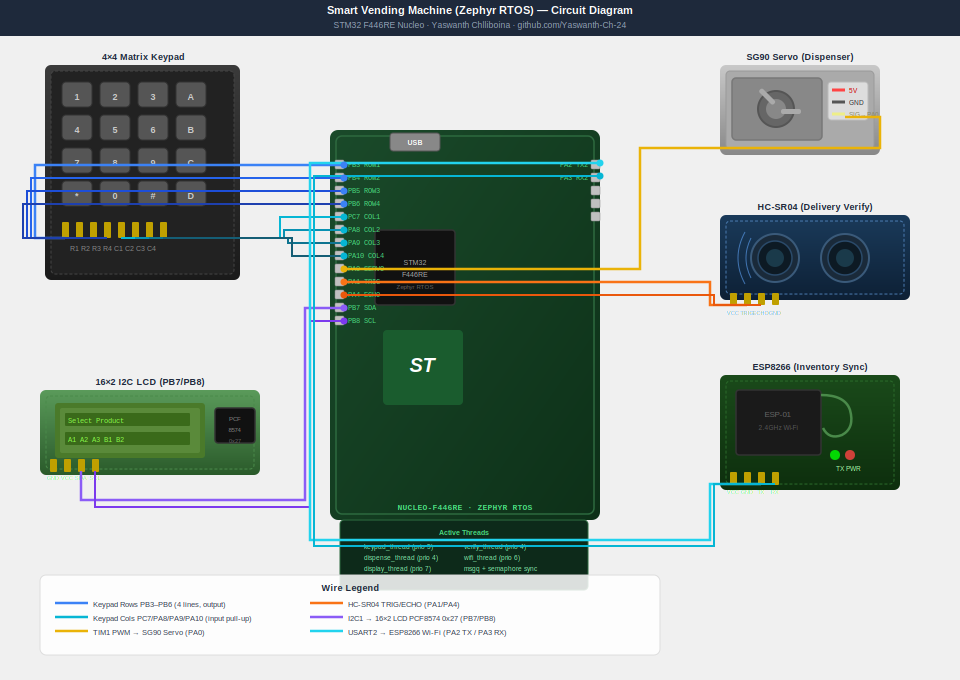

# Automated Smart Vending Machine using Zephyr RTOS

> **STM32 F446RE (Nucleo-F446RE) | Zephyr RTOS | Embedded C | 2026**
> Matrix keypad selection + PWM servo dispensing + ultrasonic delivery verification + Wi-Fi inventory management — all on STM32 F446RE running Zephyr RTOS.

---

## 📌 Board: STM32 F446RE (Nucleo-F446RE)

| Detail | Value |
|---|---|
| MCU | STM32F446RET6 |
| Core | ARM Cortex-M4 @ 180 MHz |
| Flash | 512 KB |
| RAM | 128 KB SRAM |
| Board | NUCLEO-F446RE |
| RTOS | Zephyr RTOS v3.5+ |
| IDE | VS Code + Zephyr SDK + West |
| Debugger | ST-Link V2 (on-board) |

---

## 🔍 Project Overview

A **multi-threaded smart vending machine** running on Zephyr RTOS on the STM32 F446RE Nucleo board. Zephyr's thread scheduler manages concurrent tasks: keypad scanning, servo actuation, delivery verification, and Wi-Fi inventory sync — all running independently with message queues and semaphores for synchronization.

---

## ⚡ Features

| Feature | Hardware | STM32 Interface | Zephyr Thread |
|---|---|---|---|
| Product Selection | 4x4 Matrix Keypad | GPIO Matrix Scan | keypad_thread |
| Item Dispensing | SG90 Servo | TIM1 CH1 PWM | dispense_thread |
| Delivery Verify | HC-SR04 Ultrasonic | GPIO + TIM2 | verify_thread |
| Inventory Sync | ESP8266 Wi-Fi | USART2 | wifi_thread |
| LCD Display | 16x2 I2C LCD | I2C1 | display_thread |
| Debug Logs | USB-UART | USART1 (ST-Link) | main |

---

## 🔌 Pin Connections (STM32 F446RE Nucleo)

### 4x4 Matrix Keypad — GPIO

| Keypad Pin | STM32 Pin | Nucleo Label | Direction |
|---|---|---|---|
| Row 1 | PB3 | CN10-15 | Output |
| Row 2 | PB4 | CN10-9 | Output |
| Row 3 | PB5 | CN10-13 | Output |
| Row 4 | PB6 | CN10-17 | Output |
| Col 1 | PC7 | CN10-19 | Input Pull-up |
| Col 2 | PA8 | CN10-23 | Input Pull-up |
| Col 3 | PA9 | CN10-21 | Input Pull-up |
| Col 4 | PA10 | CN10-33 | Input Pull-up |

### SG90 Servo (Dispenser) — TIM1 PWM

| Servo Pin | STM32 Pin | Nucleo Label |
|---|---|---|
| Signal | PA0 | CN7-28 (Arduino A0) |
| VCC | 5V | CN6-5 |
| GND | GND | CN6-6 |

PWM: 50Hz. 1ms = 0 degrees (locked), 1.5ms = 90 degrees (dispense).

### HC-SR04 Ultrasonic (Delivery Verify) — GPIO + TIM2

| HC-SR04 Pin | STM32 Pin | Nucleo Label |
|---|---|---|
| TRIG | PA1 | CN7-30 |
| ECHO | PA4 | CN7-32 |
| VCC | 5V | CN6-5 |
| GND | GND | CN6-6 |

### 16x2 I2C LCD (PCF8574 backpack) — I2C1

| LCD Pin | STM32 Pin | Nucleo Label |
|---|---|---|
| SDA | PB7 | CN7-21 |
| SCL | PB8 | CN10-3 |
| VCC | 5V | CN6-5 |
| GND | GND | CN6-6 |

I2C address: 0x27 (default for PCF8574 backpack).

### ESP8266 Wi-Fi — USART2

| ESP8266 Pin | STM32 Pin | Nucleo Label |
|---|---|---|
| TX | PA3 (USART2_RX) | CN10-37 |
| RX | PA2 (USART2_TX) | CN10-35 |
| VCC | 3.3V | CN6-4 |
| GND | GND | CN6-6 |

---

## 🏗️ Zephyr RTOS Thread Architecture

```text
+--------------------------------------------------+
|           Zephyr RTOS Kernel (STM32 F446RE)      |
|                                                  |
|  keypad_thread   -> scans 4x4 matrix every 50ms  |
|       | msgq_keypad (message queue)              |
|  dispense_thread -> drives TIM1 PWM servo         |
|       | sem_verify (semaphore)                   |
|  verify_thread   -> HC-SR04 confirm delivery      |
|       | msgq_inventory (message queue)           |
|  wifi_thread     -> ESP8266 AT cmds -> server     |
|  display_thread  -> I2C LCD update               |
|                                                  |
|  Preemptive scheduling | Priority-based          |
+--------------------------------------------------+
```

---

## 🔌 Circuit Diagram



> Full wiring guide in [docs/quick_start.md](docs/quick_start.md)

## 📁 Repository Structure

```text
smart-vending-machine-zephyr/
├── src/
│   ├── main.c
│   ├── keypad.c / keypad.h
│   ├── servo_dispense.c / servo_dispense.h
│   ├── ultrasonic_verify.c / ultrasonic_verify.h
│   ├── wifi_inventory.c / wifi_inventory.h
│   └── lcd_i2c.c / lcd_i2c.h
├── simulator/
│   └── simulate.py
├── CMakeLists.txt
├── prj.conf
└── README.md
```

---

## 🚀 How to Run

### Option A — Simulate on PC (No hardware needed — Start here)

```bash
cd simulator
python simulate.py
```

### Option B — Build and Flash with Zephyr

#### 1. Install Zephyr SDK

Follow the guide at [docs.zephyrproject.org](https://docs.zephyrproject.org/latest/develop/getting_started/index.html)

```bash
pip install west
west init ~/zephyrproject
cd ~/zephyrproject
west update
west zephyr-export
pip install -r zephyr/scripts/requirements.txt
```

#### 2. Build for Nucleo-F446RE

```bash
cd smart-vending-machine-zephyr
west build -b nucleo_f446re
```

#### 3. Flash

```bash
west flash
```

#### 4. Monitor Serial Output

```bash
west espressif monitor
```

Or use any serial terminal at 115200 baud.

---

## 📊 Sample Output (UART Terminal @ 115200 baud)

```text
=========================================
  Smart Vending Machine - Zephyr RTOS
  STM32 F446RE | Yaswanth Chlliboina
=========================================
[RTOS]  5 threads spawned
[INIT]  Inventory: A1=Chips(5) A2=Water(3) A3=Soda(2)
[LCD]   Select Product

[KEY]   User pressed: A1
[LCD]   A1: Chips - Rs.20
[KEY]   User pressed: # (Confirm)
[DISP]  Servo rotating to 90deg...
[DISP]  Servo reset to 0deg
[VRFY]  Ultrasonic: object detected at 12cm >> DELIVERED
[LCD]   Enjoy! Take item
[WIFI]  Inventory update sent: A1=4 remaining
[WIFI]  Server ACK received
```

---

## 👤 Author

Chlliboina Yaswanth

B.Tech Electrical and Electronics Engineering | CGPA: 8.56

Dr. Lankapalli Bullayya College of Engineering, Visakhapatnam

- Email: [yaswanth2452005@gmail.com](mailto:yaswanth2452005@gmail.com)
- LinkedIn: [yaswanth-chlliboina](https://www.linkedin.com/in/yaswanth-chlliboina/)
- GitHub: [Yaswanth-Ch-24](https://github.com/Yaswanth-Ch-24)
